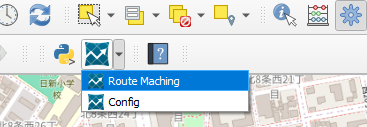

# HERE Route API Plugin

QGIS Plugin for HERE API.

[QGIS Python Plugins Repository](https://plugins.qgis.org/plugins/qgis-here-api-plugin)  

## Installation

### Get Plugin

- Install the plugin via [QGIS Python Plugins Repository](https://plugins.qgis.org/plugins/qgis-here-api-plugin) or ZIP-file downloadable from releases.  

### Authentication

- Get API Key from [HERE Platform](https://platform.here.com).  
- From the menu bar, select Plugin -> HERE Route API Plugin -> Config and enter your API Key.  

## Functions

### 1. Route matching

- Match any points in order to the most probably path, using the HERE Route Matching API.  

#### Usage

- From the menu bar, Select Plugin -> HERE API Plugin -> Route Matching.
    - Or click on the Plugin icon from the plugin toolbar

  

- Select a point layer.  
- Select a sort field. (optional, default to `fid`)  
- Select a route matching mode from car, bus, bicycle or pedestrian.  
- Click OK and the trace will be added to the map canvas as a temporary layer.  

  
  

> **Note**  
> This plugin can help you to match the trace of a large dataset, which including more than 400 points. However, The maximum number of points is limited up to 10,000.  

## License

Python modules are released under the GNU General Public License v2.0
