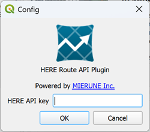

# HERE Route API Plugin

QGIS Plugin for HERE API.

## Installation

### Get plugin

-   Get this plugin via `Manage and Install Plugins...` or from [GitHub](https://github.com/MIERUNE/qgis-here-api-plugin) and `Install from Zip`.

### Authentication

-   Get API Key from https://platform.here.com/
-   From the menu bar, select Plugin -> HERE Route API Plugin -> Config and enter your API Key.  
    

## Functions

### Route matching

-   Match any points in order to the most probably path, using the HERE Route Matching API.
     
    

#### Usage

-   Select Plugin --> HERE API Plugin --> Route Matching from the menu bar.
-   Select a point layer
-   Select a sort field (optional, default to `fid`)
-   Select a route matching mode from car, bus, bicycle or pedestrian
-   Click OK and the trace will be added to the map canvas as a temporary layer  
      
    

#### Note

-   This plugin can help you to match the trace of a large dataset, which including more than 400 points. However, The maximum number of points is limited up to 10,000.

---

### License

GNU GENERAL PUBLIC LICENSE 2
